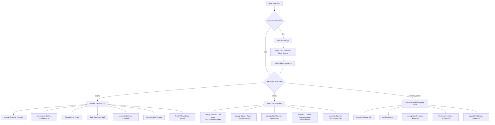

# Huston-Tillotson Housing Portal (HT Housing)
## Technical, Architectural & Project Documentation

Welcome to the comprehensive technical documentation for the **HT Housing** portal (ResLife App), developed for Huston-Tillotson University in Austin, Texas. This document describes the application architecture, system flows, feature modules, database schemas, and the operational checklist required for a successful production deployment.

---

## 1. Project Overview & Core Value

The **HT Housing** portal serves as a unified digital hub designed to streamline the student residential life experience. By replacing fragmented manual forms and email communications with a single, modern web app, the portal provides value across three target user bases:

### For Students (On-Campus Residents)
* **Unified Checklist**: A structured roadmap to guide students through the mandatory tasks required before moving in (e.g., financial clearance, immunizations, key pickup).
* **Digital Maintenance Requests**: A transparent ticket creation system where students can report room issues, request repairs, and view staff notes/updates.
* **Campus Life Info**: Access to university announcements, events, residence hall details (including coordinates/contact details), and dining services.
* **Responsive Usability**: Fully optimized mobile layout for students on-the-go or during move-in, alongside a desktop sidebar grid layout for tablets and laptops.

### For Residential Life Admin Staff
* **Operations Dashboard**: Centralized view of system stats, open work orders, and student checklist progress.
* **Maintenance Ticket Manager**: Interactive board to prioritize requests, update statuses, and log internal staff notes.
* **Staff Directory & Student Roster Editors**: Admin panels to manage university housing staff details and register new residents.
* **Communication Dispatch**: Forms to instantly publish announcements, schedule calendar events, and trigger notifications.

### For Cafeteria Admin Staff (HTU Dining Managers)
* **Cafeteria Profile Manager**: Admin panel to control general dining hall location, contact info, and special banners.
* **Dining Hours Scheduler**: Custom rules to set serving periods for breakfast, lunch, dinner, and weekend brunch.
* **Weekly Template Rotation**: Standard weekly rotating menus with category tags (Entrées, Sides, Desserts, Beverages), dietary filters (Vegetarian, Vegan, Halal), and allergen listings.
* **Daily Overrides & Alerts**: Flexibility to override template menus for special campus events (e.g., Thanksgiving Dinner) or post meal cancellations.

---

## 2. Application Architecture & Navigation Flow

The app is built on **Next.js 14** using the **App Router** framework. It leverages client-side React features for interactive components, and server-side logic for database operations, authentication validation, and API routing.

### User Flow & Navigation Diagram



### Route Protection & Next.js Middleware
Authentication states and access restrictions are checked on the server-side via [middleware.ts](file:///c:/Users/ACER/Desktop/HT-Reslife%20App/middleware.ts):
1. **Static Asset Bypass**: Any paths containing file extensions (e.g., `.png`, `.jpg`, `.ico`, `/sw.js`) and internal Next.js paths are bypassed to avoid broken images.
2. **Session Verification**: Unauthenticated requests requesting protected pages are redirected to `/login`.
3. **Role Guards**:
   * Access to `/admin/*` requires the student profile row in Supabase to show `role = 'admin'` and `is_active = true`.
   * Access to `/cafeteria-admin/*` requires `role = 'cafeteria_admin'` or `role = 'admin'`, along with `is_active = true`.
   * Violation of role guards redirects the authenticated user back to the student homepage (`/`).

### Authentication Infrastructure
* **Magic Link Auth**: Standard passwordless login. A token-based magic link is emailed to the user via Supabase Auth + Resend API.
* **Developer Bypass Login**: To accelerate local development, a developer mode bypass login is implemented. When active, it allows testers to instantly log in using registered `@htu.edu` student emails. If there is an auth credential misalignment on the Supabase auth server, a custom admin API updates the user's password to a temporary dev token on the fly to bypass validation errors.
* **Production Single Sign-On (SSO)**: The production portal is designed to support Microsoft 365 Azure AD OAuth provider configuration, ensuring students sign in using their official university credentials.

---

## 3. Detailed Feature Modules

### 3.1 Student Portal Features
* **Dashboard (`/`)**: Displays personalized student welcome metadata, a completion percentage circle for the move-in checklist, quick links, active administrative announcements, and upcoming events.
* **Checklist (`/movein`)**: Displays move-in tasks (e.g., finance clearance, health forms, key pickup). Selecting an item toggles its state, updating the database record.
* **Maintenance Request (`/maintenance`)**: A work order submission form capturing Room Number, Category (Locks, Plumbing, HVAC, Electrical, Furniture, Appliances, Pest Control, Other), Priority (Routine, Urgent, Emergency), Description, and Key Entry Authorization. Shows a feed of submitted tickets and tracking statuses (`open`, `in_progress`, `resolved`) with internal staff replies.
* **Campus Map (`/map`)**: An interactive map showcasing Huston-Tillotson residence halls (Allen-Frazier Hall, Beard-Burrowes Hall, and Teresa Hall). Displays location, capacities, and Coordinator contact details.
* **Staff Directory (`/staff`)**: Fast lookup of Residence Hall Directors (RHDs) and Resident Assistants (RAs). Supports name queries and hall filters.
* **Calendar (`/calendar`)**: Displays events and key academic/housing dates in a clean timeline layout.
* **Dining Portal (`/dining`)**: Displays real-time cafeteria open/closed status based on active operating hours (Breakfast, Lunch, Dinner, Brunch), alerts/announcements, and a complete weekly operational schedule.
* **Profile (`/profile`)**: Displays personal student profile information (assigned dorm hall, room number, contact details) and handles Web Push notification subscription status.

### 3.2 Housing Office Admin Portal Features
* **System Dashboard (`/admin`)**: Metric tiles displaying counts of active students, open maintenance tickets, and upcoming events.
* **Maintenance Manager (`/admin/maintenance`)**: A ticket management interface. Admins filter tickets by status, review student descriptions, submit internal or student-facing staff notes, and transition statuses.
* **Student Directory (`/admin/students`)**: Lists enrolled students and details. Features tools to search, edit dorm placements, register/add students, and toggle user active states.
* **Staff Management (`/admin/staff`)**: Database directory editor to add, edit, or delete staff members, update roles, and control ordering.
* **Events & Announcements Creator (`/admin/events`)**: Content management tools to compose and publish university announcements (Info, Urgent) or calendar events.

### 3.3 Cafeteria Admin Portal Features
* **Cafeteria Profile**: Form to update the dining hall name, location, email, telephone number, and upload a header banner.
* **Alert Broadcast**: Tool to post banner announcements (e.g., holiday shutdowns) with checkboxes to broadcast push notifications.
* **Operating Hours Scheduler**: Timings grid to change opening/closing boundaries for meals across Weekdays, Saturdays, and Sundays.
* **Menu Templates**: Form to seed standard weekly menus (Monday–Sunday) for different slots. Allows additions of food items, categories, dietary properties, and allergens.
* **Daily Overrides**: Interface to write custom menus for specific calendar dates, overriding the standard template. Includes options to mark a meal slot as cancelled (e.g., due to winter storm) and input details.
* **Meal Images Repository**: Image library to upload and map photos to specific meal item names, rendering images on menus.

---

## 4. Database Architecture & Schema

The backend uses **Supabase Database (PostgreSQL)** with Row Level Security (RLS) policies to isolate data and secure student privacy.

### Core Tables

```
                                +-------------------+
                                |     students      | (Auth Users Profile)
                                +-------------------+
                                 /        |        \
                                /         |         \
                               v          v          v
   +---------------------+   +------------------+   +--------------------+
   | maintenance_tickets |   |  announcements   |   | checklist_progress |
   +---------------------+   +------------------+   +--------------------+
                                                             |
                                                             v
                                                    +--------------------+
                                                    |  checklist_items   |
                                                    +--------------------+
```

#### `public.students`
Stores account profiles mapped to `auth.users.id`.
* `id` (uuid, primary key, references `auth.users.id`)
* `email` (text, unique)
* `full_name` (text)
* `room_number` (text, nullable)
* `hall_name` (text, nullable)
* `role` (text check: `'student'`, `'admin'`, `'cafeteria_admin'`)
* `is_active` (boolean)
* `push_subscription` (jsonb, for Web Push subscriptions)
* `created_at` (timestamptz)

#### `public.maintenance_tickets`
Tracks facility maintenance requests submitted by students.
* `id` (uuid, primary key)
* `student_id` (uuid, references `students.id`)
* `room_number` (text)
* `issue_type` (text)
* `priority` (text check: `'routine'`, `'urgent'`, `'emergency'`)
* `description` (text)
* `allow_entry` (boolean)
* `status` (text check: `'open'`, `'in_progress'`, `'resolved'`)
* `staff_notes` (text, nullable)
* `created_at` (timestamptz)
* `updated_at` (timestamptz)

#### `public.staff_directory`
Houses RA and Coordinator contact details shown in the student directory.
* `id` (uuid, primary key)
* `full_name` (text)
* `role` (text)
* `hall` (text, nullable)
* `phone` (text, nullable)
* `email` (text, nullable)
* `avatar_initials` (text)
* `sort_order` (integer)

#### `public.checklist_items` & `public.checklist_progress`
Maintains the items template and tracks progress per student.
* **`checklist_items`**:
  * `id` (uuid, primary key)
  * `label` (text)
  * `sort_order` (integer)
* **`checklist_progress`**:
  * `id` (uuid, primary key)
  * `student_id` (uuid, references `students.id`)
  * `item_id` (uuid, references `checklist_items.id`)
  * `completed` (boolean)
  * *Constraint*: Unique combination of `student_id` and `item_id`

#### `public.academic_calendar`
Stores academic and housing calendar items.
* `id` (uuid, primary key)
* `title` (text)
* `description` (text, nullable)
* `start_date` (date)
* `end_date` (date, nullable)
* `category` (text check: `'academic'`, `'holiday'`, `'deadline'`, `'housing'`, `'registration'`)
* `created_at` (timestamptz)

### Dining & Cafeteria Tables

#### `public.cafeteria_info`
* `id` (uuid, primary key)
* `name` (text)
* `location` (text, nullable)
* `phone` (text, nullable)
* `email` (text, nullable)
* `announcement` (text, nullable)
* `image_url` (text, nullable)
* `updated_at` (timestamptz)

#### `public.dining_hours`
* `id` (uuid, primary key)
* `day_type` (text check: `'weekday'`, `'saturday'`, `'sunday'`)
* `meal_slot` (text check: `'breakfast'`, `'lunch'`, `'dinner'`, `'brunch'`)
* `open_time` (text)
* `close_time` (text)
* `is_active` (boolean)
* *Constraint*: Unique combination of `day_type` and `meal_slot`

#### `public.menu_template`
* `id` (uuid, primary key)
* `day_of_week` (integer check: `0` to `6` representing Monday to Sunday)
* `meal_slot` (text check: `'breakfast'`, `'lunch'`, `'dinner'`, `'brunch'`)
* `items` (jsonb array containing item maps)
* `updated_at` (timestamptz)
* *Constraint*: Unique combination of `day_of_week` and `meal_slot`

#### `public.daily_menu`
* `id` (uuid, primary key)
* `menu_date` (date)
* `meal_slot` (text check: `'breakfast'`, `'lunch'`, `'dinner'`, `'brunch'`)
* `items` (jsonb array)
* `special_note` (text, nullable)
* `is_cancelled` (boolean)
* `cancel_reason` (text, nullable)
* `created_by` (uuid, references `students.id`)
* `updated_at` (timestamptz)
* *Constraint*: Unique combination of `menu_date` and `meal_slot`

#### `public.meal_images`
* `id` (uuid, primary key)
* `item_name` (text, unique)
* `image_url` (text)
* `uploaded_at` (timestamptz)

---

### Row Level Security (RLS) Configuration

Supabase enforces fine-grained access policies:
1. **Students Table**: Students can only `SELECT` and `UPDATE` their own row (and cannot modify their `role`). Admins have access to query and modify all user rows.
2. **Checklist & Maintenance Tickets**: Students can select, update, or insert only records matching their authenticated `student_id`. Admins have global `ALL` permissions.
3. **Dining, Staff, FAQs, Calendar & Announcements**: All authenticated users are granted `SELECT` permissions to read directory and cafeteria details. Write/Edit permissions (`INSERT`, `UPDATE`, `DELETE`) are locked and granted only to users with the `'admin'` or `'cafeteria_admin'` roles.

---

## 5. Technology Stack & Deployment Setup

### Stack Architecture
* **Frontend**: Next.js 14 (App Router) + TypeScript + React
* **Styling**: Tailwind CSS & Vanilla CSS (configured around official university colors)
* **Backend Database & RLS**: Supabase (PostgreSQL)
* **Authentication**: Supabase Auth (with email Magic Links, Azure AD SSO options)
* **Email Delivery**: Resend API
* **Push Notifications**: Web-Push VAPID API
* **Hosting Platform**: Vercel

### Color Palette (HTU Brand Guidelines)
* **Primary Maroon**: `#660100` (Used in sidebars, buttons, branding components)
* **Secondary Gold**: `#FFCC00` (Used in highlights, badges, icons)
* **Sand Background**: `#FFFAEB` (Differentiates page blocks, panels)
* **Terra Core Text**: `#291C14` (Ensures readable contrast for copy)

### Required Environment Variables (`.env.local`)
| Variable Name | Purpose | Example / Format |
| :--- | :--- | :--- |
| `NEXT_PUBLIC_SUPABASE_URL` | Supabase API Endpoint URL | `https://your-proj.supabase.co` |
| `NEXT_PUBLIC_SUPABASE_ANON_KEY` | Public access key for database and client client | `eyJhbGciOi...` |
| `SUPABASE_SERVICE_ROLE_KEY` | Bypass RLS key for Admin bypass/migration scripts | `eyJhbGciOi...` |
| `NEXT_PUBLIC_APP_URL` | URL of the running application for redirect mapping | `https://housing.htu.edu` |
| `RESEND_API_KEY` | Auth token for email delivery | `re_123456789...` |
| `NEXT_PUBLIC_VAPID_PUBLIC_KEY` | Public key to sign push subscriptions on client | `BI-...` |
| `VAPID_PRIVATE_KEY` | Private key to sign server notifications | `d8-...` |

---

## 6. Production Launch Roadmap

Prior to launching the HT Housing portal, complete the following setup items:

### 1. Azure AD / Microsoft 365 Single Sign-On Integration
To transition from Magic Links to enterprise university logins:
* Register the application in the **Microsoft Azure Portal** under App Registrations.
* Set the Redirect URI to: `https://<YOUR_SUPABASE_PROJECT_ID>.supabase.co/auth/v1/callback`.
* Set Supported Account Types to *"Accounts in any organizational directory (Any Azure AD directory - Multitenant)"*.
* Add API Permissions for Microsoft Graph: `User.Read`.
* Generate a Client Secret and copy it, along with the Client ID, into the **Supabase Dashboard → Authentication → Providers → Azure** section.

### 2. Official Communications Email Domain Configuration
For sending authentication links and maintenance alerts:
* Register at **Resend** (resend.com) and verify the university email sending domain (e.g., `htu.edu`).
* Coordinate with the university IT administrator to add the required **SPF, DKIM, and DMARC** TXT records to the HTU Domain Name System (DNS) configurations to authenticate outbound emails.
* Update the sender profile address in `lib/email.ts` to `housing@htu.edu` or `reslife@htu.edu`.

### 3. Production DB Seeding & Migrations
* Set up a clean production instance in Supabase.
* Execute the SQL schema script located in [`schema.sql`](file:///c:/Users/ACER/Desktop/HT-Reslife%20App/lib/supabase/schema.sql) followed by the extensions ([`dining-schema.sql`](file:///c:/Users/ACER/Desktop/HT-Reslife%20App/lib/supabase/dining-schema.sql) and [`create_calendar_table.sql`](file:///c:/Users/ACER/Desktop/HT-Reslife%20App/lib/supabase/create_calendar_table.sql)).
* Seed the core checklist templates and university FAQ details.
* Upload the approved roster of students (with full names, assigned halls, room numbers, and emails) into the `public.students` table to restrict access strictly to active residents.

### 4. VAPID Keys Setup for Push Notifications
* Generate production key pairs using the command: `npx web-push generate-vapid-keys`.
* Copy the output keys into the environment variables configuration on Vercel.

### 5. Custom Domain Configuration
* In the Vercel project settings, map the custom subdomain (e.g., `housing.htu.edu`) to the Vercel deployment.
* Add DNS CNAME records pointing from the subdomain registrar to `cname.vercel-dns.com`.
